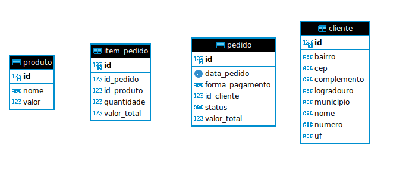

# Microservice and Web Engineering - 3SIT/2024

## Check Point 1/2º semestre - Prof. Antonio Carlos de Lima Júnior

### Instruções Gerais

- Prazo de entrega: __03/10__.
- O checkpoint deverá ser desenvolvido em até 2 pessoas.
- Cada pessoa deve ter o projeto em seu próprio repositório "fiap-checkpoint1-sem2" no Github até a data de entrega.
- Cada pessoa realizar a entrega na área de trabalho informando o link do repositório no Github.

### Atividades

#### 1. (_3 pontos_) - Implementar as entidades e persistencia.

#### 2. (_7 pontos_) - Implementar as classes de service, controller e DTOs para realização de operações CRUD.

